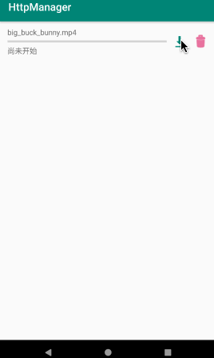

[](http://www.apache.org/licenses/LICENSE-2.0)
[](https://jitpack.io/#wkxjc/HttpManager)

# HttpManager English Doc | [中文文档](https://github.com/wkxjc/HttpManager/blob/master/README_CN.MD)

## Description

This is a library that encapsulates Http network requests, HTTP multi-interface merges, and network file downloads. Adapted from [wzgiceman](https://github.com/wzgiceman)'s [RxRetrofit library](https://github.com/wzgiceman/RxjavaRetrofitDemo-string-master).

## Screenshots

<span>&nbsp;&nbsp;&nbsp;&nbsp;</span><span>&nbsp;&nbsp;&nbsp;&nbsp;</span>

## Download

Step 1. Add it in your root *build.gradle* at the end of repositories:

```
allprojects {
	repositories {
		...
		maven { url 'https://jitpack.io' }
	}
}
```

Step 2. Add the dependency

```
implementation 'com.github.wkxjc:HttpManager:1.5'
```

## How to use?

1.Single network request：

```
httpManager.request(randomWallpaperApi, object : HttpListener() {

    override fun onNext(result: String) {
        tvResult.text = result
    }
    
    override fun onError(error: Throwable) {
        tvResult.text = error.message
    }
})
```

2.Multiple network requests：

```
httpManager.request(
    apis = arrayOf(randomWallpaperApi, categoryApi),
    listener = object : HttpListListener() {
        
        /**
         * Single api result callback
         */
        override fun onSingleNext(api: BaseApi, result: String): Any {
            when (api) {
                randomWallpaperApi -> {
                    Log.d("HttpListActivity", "Single api result callback: randomWallpaperApi:$result")
                    // Here you can convert the returned string to any object, generally using Gson/fastJson to pause the object here.
                    return 123
                }
                categoryApi -> Log.d("HttpListActivity", "Single api result callback: categoryApi:$result")
            }
            return super.onSingleNext(api, result)
        }
        
        /**
         * All api result callbacks
         */
        override fun onNext(resultMap: HashMap<BaseApi, Any>) {
            // use "as" method, convert the object saved in resultMap to the type returned by onSingleNext.
            tvResultList.text =
                "randomWallpaperApi result: ${resultMap[randomWallpaperApi] as Int}\n" +
                        "categoryApi result: ${resultMap[categoryApi].toString()}"
        }
        
        override fun onError(error: Throwable) {
            tvResultList.text = error.message
        }
    }
)
```

3.Download network file：

```
HttpDownManager.down(DownConfig().apply {
    url = "http://clips.vorwaerts-gmbh.de/big_buck_bunny.mp4"
})
```

## Configuration

Before using HttpManager for a single api request or multiple api requests, you need some preparation.

Step 1. Create a new ApiConfig, inherit from DefaultApiConfig, and override the baseUrl variable:

```
class ApiConfig : DefaultApiConfig() {
    override var baseUrl = "Your network request BaseUrl"
}
```

Step 2. Initialize RxRetrofitApp in Application:

```
RxRetrofitApp.apply {
    application = this@MyApplication
    apiConfig = ApiConfig()
}
```

Step 3. Similar to using the Retrofit library, create a new ApiService, for example:

```
interface WallpaperApiService {

    @GET("v1/vertical/vertical")
    fun getRandomWallpaper(
        @Query("limit") limit: Int = 30,
        @Query("skip") skip: Int = 0,
        @Query("adult") adult: Boolean = false,
        @Query("first") first: Int = 0,
        @Query("order") order: String = "hot"
    ): Observable<String>
}
```

Create a new Api, inherited from BaseApi, for example:

```
class RandomWallpaperApi : BaseApi() {

    override fun getObservable(): Observable<String> {
        val apiService = retrofit.create(WallpaperApiService::class.java)
        return apiService.getRandomWallpaper()
    }
}
```

OK, now you can use httpManager to get the result of your api.

Before using HttpDownManager, just make sure to initialize the RxRetrofitApp application in the Application.

```
RxRetrofitApp.apply {
    application = this@MyApplication
}
```

## ResultConverter

In actual development, the data returned by the background interface is generally in a fixed format. For example, the fixed format in this Demo is as follows:

```
class BaseResult {
    // code == 0 means request succeed
    var code: Int = 0
    // This variable carries an error message when request failed
    var msg: String = ""
    // This variable means the returned business data
    var res: String = ""
}
```

In this library, we can parse the returned data according to the fixed format first, and only deliver the returned business data to the business layer. Create a new ResultConverter:

```
class ResultConverter : IResultConverter {
    override fun convert(response: String): String {
        // parse the result according to BaseResult here
        val result = JSONObject.parseObject(response, BaseResult::class.java)
        // handle errors through defined error codes
        if (result.code != 0) throw Throwable("code != 0, msg = ${result.msg}")
        return result.res
    }
}
```

Then set it in the Application:

```
RxRetrofitApp.apply {
    ...
    resultConverter = ResultConverter()
}
```

You can turned off it in the api via the "ignoreJudge" configuration.

## HttpResponseProcessor

Sometimes, the background does not return an error message through the errorMessage of the BaseResult structure, but the error code of "404" or "403" requested by the Http request informs us that the request is failed.
In this library, you can process the http response uniformly. Create a new HttpResponseProcessor:

```
class HttpResponseProcessor : IHttpResponseProcessor {
    override fun handleResponse(response: Response): Response {
        // Here you can handle the http error code: response.code(), this error code is different from the errorCode in BaseResult.
        if (response.code() >= 400) throw Throwable("Http response code = ${response.code()}")
        return response
    }
}
```

Then set it in the Application:

```
RxRetrofitApp.apply {
    ...
    httpResponseProcessor = HttpResponseProcessor()
}
```

## Custom configuration

### 1.Globally modify the network request default configuration
      
In ApiConfig, you can not only configure baseUrl, but also configure the following parameters. The following are the default values：

```
open class DefaultApiConfig {
    // BaseUrl requested by Retrofit Network
    open var baseUrl = ""
    // Whether to display the loading dialog
    open var showLoading = true
    // Whether the loading dialog can be cancelled
    open var loadingCancelable = true
    // Cache configuration
    open var cacheConfig = CacheConfig().apply {
        // Do you need cache
        cache = false
        // Cache expiration time when the network is available
        onlineCacheTime = 30
        // Cache expiration time when the network is unavailable
        offlineCacheTime = 60 * 60 * 24 * 30
    }
    // Whether to ignore the BaseResult converter
    open var ignoreJudge: Boolean = false
    // Retry configuration
    open var retry = RetryConfig().apply {
        // times of retry
        count = 5
        // Retry delay time
        delay = 100L
        // increase the delay time each time
        increaseDelay = 500L
    }
    // timeout configuration
    open var timeOutConfig = TimeoutConfig().apply {
        connectionTime = 10L
        readTime = 10L
        writeTime = 10L
    }
    // Http request header information
    open var headers: Headers? = null
}
```

The configuration here is valid for all network requests.

### 2. Modify single network request default configuration

The configurable parameters of single configuration is the same as the global configuration. For example:

```
class RandomWallpaperApi : BaseApi() {

    init {
        baseUrl = "baseUrl of this single api"
        showLoading = true
        loadingCancelable = true
        cacheConfig = CacheConfig().apply {
            cache = false
            onlineCacheTime = 30
            offlineCacheTime = 60 * 60 * 24 * 30
        }
        ignoreJudge = false
        retry = RetryConfig().apply {
            count = 5
            delay = 100L
            increaseDelay = 500L
        }
        timeOutConfig = TimeoutConfig().apply {
            connectionTime = 10L
            readTime = 10L
            writeTime = 10L
        }
        // For example:
        headers = Headers.of(mapOf("name1" to "value1", "name2" to "value2"))
    }
    
    override fun getObservable(): Observable<String> {
        val apiService = retrofit.create(WallpaperApiService::class.java)
        return apiService.getRandomWallpaper()
    }
}
```

### 3.Http multi-interface request global configuration
    
When you request an array of apis, the configuration of every single api is still valid. Only the two parameters, showLoading and loadingCancelable, are invalid.
The configurable parameters of multi-interface request are as follows, the following are the default values:

```
open class DefaultHttpListConfig {
    // Whether to display the loading dialog
    open var showLoading: Boolean = true
    // Whether the loading dialog can be cancelled
    open var loadingCancelable: Boolean = true
    // Whether to request apis in order
    open var order: Boolean = false
}
```

If you need to modify the configuration of the Http multi-interface request globally, create a new HttpListConfig class, which inherits from DefaultHttpListConfig:

```
class HttpListConfig : DefaultHttpListConfig() {
    override var showLoading = true
    override var loadingCancelable = true
    override var order = false
}
```

Then set it in the Application:

```
RxRetrofitApp.apply {
    ...
    httpListConfig = HttpListConfig()
}
```
### 4.Separately configure multi-interface request 

The configurable parameters of single configuration is the same as the global configuration. For example:

```
httpManager.request(
    apis = apis,
    config = HttpListConfig(showLoading = true, loadingCancelable = true, order = false),
    listener = listener
)
```

### 5.HttpDownManager global configuration

When you use HttpDownManager downloading files, the global default configuration is as follows:

```
open class DefaultDownConfig {
    /**The saved folder path, if not set, the default path is "app cache path/download". If it's set to external path, you need to ensure that the app have read and write permissions*/
    var saveDir: String = ""
        get() {
            if (field.isNotEmpty()) return field
            val cacheDir = RxRetrofitApp.application.externalCacheDir.absolutePath
                ?: throw Throwable("application is null")
            return "$cacheDir/download/"
        }
    /**Update the progress after downloading progressStep bits. Use [PROGRESS_BY_PERCENT] to update by percentage*/
    var progressStep = 1024 * 4
    /**Retry configuration*/
    var retry = RetryConfig()
    /**Http request header information*/
    var headers: Headers? = null
}
```

If you need to modify the global configuration, create a new DownConfig class, inheriting from the DefaultDownConfig class:

```
class DownConfig :DefaultDownConfig(){
    override var saveDir: String = ""
        get() {
            if (field.isNotEmpty()) return field
            val cacheDir = RxRetrofitApp.application.externalCacheDir?.absolutePath
                ?: throw Throwable("application is null")
            return "$cacheDir/download/"
        }
    override var progressStep = 1024 * 4
    override var retry = RetryConfig()
    override var headers: Headers? = null
}
```

Then set it in the Application:

```
RxRetrofitApp.apply {
    ...
    downConfig = DownConfig()
}
```

### 6.Configure HttpDownManager separately

The configurable parameters of single configuration is the same as the global configuration. For example:

```
HttpDownManager.down(DownConfig().apply {
    url = "http://clips.vorwaerts-gmbh.de/big_buck_bunny.mp4"
    saveDir = "${RxRetrofitApp.application.externalCacheDir?.absolutePath}/download/"
    /**The name of the saved file. If not set, the default name is the last path segment of the url.*/
    saveFileName = "big_buck_bunny.mp4"
    progressStep = 1024 * 128
    retry = RetryConfig()
    headers = Headers.of(mapOf("name1" to "value1", "name2" to "value2"))
})
```

## Bug Feedback

If you have any questions or suggestions, feel free to create an [issue](https://github.com/wkxjc/HttpManager/issues).

## LICENSE

    Copyright (c) 2019-present, Alpinist Wang Contributors.

    Licensed under the Apache License, Version 2.0 (the "License");
    you may not use this file except in compliance with the License.
    You may obtain a copy of the License at

    http://www.apache.org/licenses/LICENSE-2.0

    Unless required by applicable law or agreed to in writing, software
    distributed under the License is distributed on an "AS IS" BASIS,
    WITHOUT WARRANTIES OR CONDITIONS OF ANY KIND, either express or implied.
    See the License for the specific language governing permissions and
    limitations under the License.