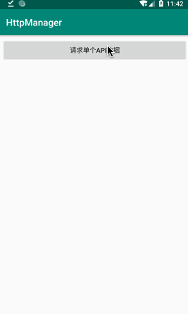

[](http://www.apache.org/licenses/LICENSE-2.0)
[](https://jitpack.io/#wkxjc/HttpManager)

# HttpManager 中文文档 | [English Doc](https://github.com/wkxjc/HttpManager/blob/master/README.MD)

## 描述

这是一个封装了 HTTP 网络请求、HTTP 多接口合并、网络文件下载的库。改编自[wzgiceman](https://github.com/wzgiceman)的[RxRetrofit库](https://github.com/wzgiceman/RxjavaRetrofitDemo-string-master)。

## 屏幕截图

<span>&nbsp;&nbsp;&nbsp;&nbsp;</span><span>&nbsp;&nbsp;&nbsp;&nbsp;</span>

## 下载

第一步. 在根目录的 *build.gradle* 中添加以下代码:

```groovy
allprojects {
	repositories {
		// ...
		maven { url 'https://jitpack.io' }
	}
}
```

第二步. 添加 gradle 依赖

```groovy
implementation 'com.github.wkxjc:HttpManager:2.0'
```

## 如何使用？

1.单个网络请求：

```kotlin
private val httpManager by lazy { HttpManager(this) }
// ...
httpManager.request(homeArticlesApi, object : HttpListener() {

    override fun onNext(result: String) {
        tvResult.text = result
    }
    
    override fun onError(error: Throwable) {
        tvResult.text = error.message
    }
})
```

2.多个网络请求：

```kotlin
private val httpManager by lazy { HttpManager(this) }
// ...
httpManager.request(
    apis = arrayOf(homeArticlesApi, bannerApi),
    listener = object : HttpListListener() {
        
        /**
         * 单个 api 结果回调
         */
        override fun onSingleNext(api: BaseApi, result: String): Any {
            when (api) {
                homeArticlesApi -> {
                    Log.d("HttpListActivity", "收到单个结果：homeArticlesApi:$result")
                    // 这里可以将返回的字符串转换为任意对象，一般在这里使用Gson/fastJson解析对象
                    return 123
                }
                bannerApi -> Log.d("HttpListActivity", "收到单个结果：bannerApi:$result")
            }
            return super.onSingleNext(api, result)
        }
        
        /**
         * 所有 api 结果回调
         */
        override fun onNext(resultMap: HashMap<BaseApi, Any>) {
            // 通过 as 方法，将resultMap中保存的对象取出并转换成onSingleNext返回的类型
            tvResultList.text =
                "homeArticlesApi result: ${resultMap[homeArticlesApi] as Int}\n" +
                        "bannerApi result: ${resultMap[bannerApi].toString()}"
        }
        
        override fun onError(error: Throwable) {
            tvResultList.text = error.message
        }
    }
)
```

3.下载网络文件：

```kotlin
DownManager.download(DownloadApi().apply {
    url = "https://media.w3.org/2010/05/sintel/trailer.mp4"
})
```

## 配置

使用 HttpManager 进行单个 api 请求或多个 api 请求之前，你需要一些准备工作.

第一步. 新建 MyApiConfig，继承自 ApiConfig，重写 baseUrl 变量：

```kotlin
class MyApiConfig : ApiConfig() {
    override var baseUrl = "你的网络请求 BaseUrl"
}
```

第二步. 在 Application 中初始化 RxRetrofitApp，设置 apiConfig:

```kotlin
RxRetrofitApp.apply {
    application = this@MyApplication
    apiConfig = MyApiConfig()
}
```

第三步. 和使用 Retrofit 库类似，新建 ApiService，例如：

```kotlin
interface ApiService {

    /**
     * 首页文章
     */
    @GET("article/list/{page}/json")
    fun getHomeArticles(@Path("page") page: Int): Observable<String>
}
```

新建 Api，继承自 BaseApi，例如：

```kotlin
class HomeArticlesApi : BaseApi() {

    override fun getObservable(): Observable<String> {
        val apiService = retrofit.create(ApiService::class.java)
        return apiService.getHomeArticles(0)
    }
}
```

OK，这样就能获取到接口请求结果了。

使用 DownManager 进行网络文件下载之前，只需要确保在 Application 中初始化了 RxRetrofitApp 的 application 即可。

```kotlin
RxRetrofitApp.apply {
    application = this@MyApplication
}
```

## 返回结果统一解析

在实际开发中，后台接口返回的数据一般是有统一格式的，例如本 Demo 中接口返回的数据统一格式如下：

```kotlin
data class BaseResult(
    // 此变量为0表示请求成功
    val errorCode: Int,
    // 请求失败时，此变量携带错误信息
    val errorMsg: String,
    // 此变量存储返回的业务数据
    val data: String?
)
```

在此框架中，我们可以将返回数据先统一按此结构解析，仅将返回的业务数据传到业务层。新建 ResultConverter：

```kotlin
class ResultConverter : IResultConverter {
    override fun convert(response: String): String {
        // 在这里对结果统一解析
        val result = JSONObject.parseObject(response, BaseResult::class.java)
        // 通过定义的错误码，统一做错误处理
        if (result.errorCode != 0) throw Throwable("errorCode != 0, errorMsg = ${result.errorMsg}")
        return result.data ?: ""
    }
}
```

然后在 MyApiConfig 中设置即可：

```kotlin
class MyApiConfig : ApiConfig() {
    // ...
    override var resultConverter: IResultConverter = ResultConverter()
}
```

在 api 中可以通过 apiConfig.ignoreResultConverter 配置关闭这一层解析

## Http 返回码统一处理

有时候，后台并不会通过 BaseResult 结构的 errorMessage 返回错误信息，而是通过 Http 请求的 "404" 或者 "403" 等等错误码告知前端请求错误。
在此框架中，我们可以将 Http 返回码统一处理。新建 HttpResponseProcessor：

```kotlin
class HttpResponseProcessor : IHttpResponseProcessor {
    override fun handleResponse(response: Response): Response {
        // 在这里可以处理http返回的错误码：response.code()，这里的错误码不同于BaseResult中的errorCode
        if (response.code() >= 400) throw Throwable("Http response code = ${response.code()}")
        return response
    }
}
```

然后在 MyApiConfig 中设置即可：

```kotlin
class MyApiConfig : ApiConfig() {
    // ...
    override var httpResponseProcessor: IHttpResponseProcessor = HttpResponseProcessor()
}
```

在 api 中可以通过 apiConfig.ignoreResponseProcessor 配置关闭这一层解析

## 定制

### 1.全局修改网络请求默认配置

在 ApiConfig 中，不仅可以配置 baseUrl ，还可以配置以下参数，以下是默认值：

```kotlin
open class ApiConfig {
    // Retrofit 网络请求的 BaseUrl
    open var baseUrl = ""

    // 是否显示 Loading 弹窗
    open var showLoading = true

    // Loading 弹窗是否可取消
    open var loadingCancelable = true

    // 缓存配置
    open var cacheConfig = CacheConfig().apply {
        // 是否需要缓存
        cache = false
        // 网络可用时缓存过期时间
        onlineCacheTime = 30
        // 网络不可用时缓存过期时间
        offlineCacheTime = 60 * 60 * 24 * 30
    }
    // 是否忽略 ResultConverter 解析
    open var ignoreResultConverter: Boolean = false

    // 是否忽略 ResponseProcessor 对返回结果的处理
    open var ignoreResponseProcessor: Boolean = false

    // 重试配置
    open var retry = RetryConfig().apply {
        // 重试次数
        count = 5
        // 重试等待时间
        delay = 100L
        // 每次重试的延长时间
        increaseDelay = 500L
    }

    // 超时时间配置
    open var timeOutConfig = TimeoutConfig().apply {
        connectionTime = 10L
        readTime = 10L
        writeTime = 10L
    }

    // Http请求head信息
    open var headers: Headers? = null

    // 返回数据统一转换类
    open var resultConverter: IResultConverter = DefaultResultConverter()

    // Http 响应统一处理类
    open var httpResponseProcessor: IHttpResponseProcessor = DefaultHttpResponseProcessor()
}
```

在这里的配置是对所有的网络请求生效的。

### 2.单个网络请求修改默认配置

单个网络请求可配置参数与全局网络请求可配置参数相同。使用示例：

```kotlin
class HomeArticlesApi : BaseApi() {

    init {
        // Retrofit网络请求的BaseUrl
        apiConfig.baseUrl = "单独配置baseUrl"
        // 是否显示Loading弹窗
        apiConfig.showLoading = true
        // Loading弹窗是否可取消
        apiConfig.loadingCancelable = true
        // 缓存配置
        apiConfig.cacheConfig = CacheConfig().apply {
            // 是否需要缓存处理
            cache = false
            // 网络可用时的缓存过期时间
            onlineCacheTime = 30
            // 网络不可用时的缓存过期时间
            offlineCacheTime = 60 * 60 * 24 * 30
        }
        // 是否忽略ResultConverter解析
        apiConfig.ignoreResultConverter = false
        // 是否忽略ResponseProcessor对返回结果的处理
        apiConfig.ignoreResponseProcessor = false
        // 重试配置
        apiConfig.retry = RetryConfig().apply {
            // 重试次数
            count = 5
            // 重试延迟时间
            delay = 100L
            // 每次增加延迟的时间
            increaseDelay = 500L
        }
        // 超时时间配置
        apiConfig.timeOutConfig = TimeoutConfig().apply {
            // 连接超时时间
            connectionTime = 10L
            // 读取超时时间
            readTime = 10L
            // 写入超时时间
            writeTime = 10L
        }
        // Http请求head信息，示例如下：
        apiConfig.headers = Headers.of(mapOf("name1" to "value1", "name2" to "value2"))
    }
    
    override fun getObservable(): Observable<String> {
        val apiService = retrofit.create(ApiService::class.java)
        return apiService.getHomeArticles(0)
    }
}
```

### 3.Http多接口合并请求全局配置

Http 多接口合并请求时，单个 api 配置的参数大多数仍然生效，只有 showLoading、loadingCancelable 两个参数不再生效，需要单独配置。
多接口合并可配置参数如下，以下是默认值：

```kotlin
open class HttpListConfig {
    // 是否显示Loading弹窗
    open var showLoading: Boolean = true

    // Loading弹窗是否可取消
    open var loadingCancelable: Boolean = true

    // 是否按照顺序请求api
    open var order: Boolean = true
}
```

如果需要全局修改Http多接口请求的配置，新建 MyHttpListApiConfig 类，继承自 HttpListConfig：

```kotlin
class MyHttpListApiConfig : HttpListConfig() {
    override var showLoading = false
    override var order = false
}
```

然后在 Application中 设置即可：

```kotlin
RxRetrofitApp.apply {
    // ...
    httpListConfig = MyHttpListApiConfig()
}
```

### 4.Http多接口合并请求单独配置

单独配置与全局配置的可配置参数相同。使用示例：

```kotlin
httpManager.request(
    apis, listener,
    HttpListConfig().apply {
        showLoading = true
        loadingCancelable = true
        order = false
    },
)
```

### 5.DownloadManager 下载文件全局配置

下载文件时，全局默认配置如下：

```kotlin
open class DownloadConfig {
    companion object {
        // 下载进度更新频率，此值表示按照进度的百分之一更新
        const val PROGRESS_BY_PERCENT = -1
    }

    /**保存的文件夹路径，如果不设置，默认路径是"应用缓存路径/download/",如果设置为外部路径，需要自己确保有读写权限*/
    open var saveDir: String = ""
        get() {
            if (field.isNotEmpty()) return field
            val cacheDir = RxRetrofitApp.application.externalCacheDir?.absolutePath
                ?: throw Throwable("application is null")
            return "$cacheDir/download/"
        }

    /**下载进度更新频率，即下载多少 B 之后更新一次，默认 4KB。使用 [PROGRESS_BY_PERCENT] 表示按百分比更新*/
    open var progressStep = 1024 * 4

    /**重试配置*/
    open var retry = RetryConfig()

    /**head 信息*/
    open var headers: Headers? = null
}
```

如果需要修改全局配置，新建 MyDownConfig 类，继承自 DownConfig 类：

```kotlin
class MyDownConfig : DownConfig(){
    /**保存的文件夹路径，如果不设置，默认路径是"应用缓存路径/download/",如果设置为外部路径，需要自己确保有读写权限*/
    override var saveDir: String = ""
        get() {
            if (field.isNotEmpty()) return field
            val cacheDir = RxRetrofitApp.application.externalCacheDir?.absolutePath
                ?: throw Throwable("application is null")
            return "$cacheDir/download/"
        }
    /**下载进度更新频率，即下载多少B之后更新一次，默认4K。使用[PROGRESS_BY_PERCENT]表示按百分比更新*/
    override var progressStep = 1024 * 4
    /**重试配置*/
    override var retry = RetryConfig()
    /**head信息*/
    override var headers: Headers? = null
}
```

然后在Application中设置即可：

```kotlin
RxRetrofitApp.apply {
    // ...
    downConfig = MyDownConfig()
}
```

### 6.Http下载文件单独配置

单独配置与全局配置的可配置参数相同。使用示例：

```kotlin
DownManager.down(DownConfig().apply {
    url = "下载地址"
    /**保存的文件名字，如果不设置，默认名字是url的最后一段*/
    saveFileName = "文件名.mp4"
    downloadConfig.saveDir = "${RxRetrofitApp.application.externalCacheDir?.absolutePath}/download/"
    /**进度更新频率，下载多少Byte后更新一次进度。默认每下载4KB更新一次，使用[DownloadConfig.PROGRESS_BY_PERCENT]表示每下载百分之一更新一次*/
    downloadConfig.progressStep = 1024 * 128
    /**重试配置*/
    downloadConfig.retry = RetryConfig()
    /**head信息*/
    downloadConfig.headers = Headers.of(mapOf("name1" to "value1", "name2" to "value2"))
})
```

## Bug 反馈

如果您有任何反馈或建议，欢迎提交到 [Github issues](https://github.com/wkxjc/HttpManager/issues).

## LICENSE

    Copyright (c) 2021-present, Alpinist Wang Contributors.

    Licensed under the Apache License, Version 2.0 (the "License");
    you may not use this file except in compliance with the License.
    You may obtain a copy of the License at

    http://www.apache.org/licenses/LICENSE-2.0

    Unless required by applicable law or agreed to in writing, software
    distributed under the License is distributed on an "AS IS" BASIS,
    WITHOUT WARRANTIES OR CONDITIONS OF ANY KIND, either express or implied.
    See the License for the specific language governing permissions and
    limitations under the License.